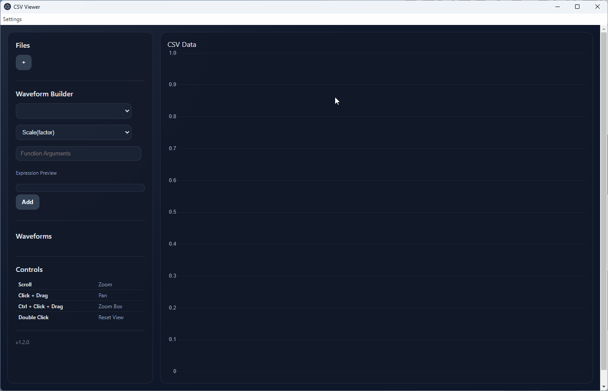

# CSV Data Viewer

---

## Overview

The CSV Data Viewer is a lightweight desktop application for loading, visualising, and exploring CSV datasets.

Built with Electron, it allows you to:

- Load and plot multiple CSV files simultaneously
- Automatically detect and visualise numeric data
- Compare datasets across files
- Interactively zoom, pan, and inspect large datasets

The tool is designed for engineers and developers who need a fast, simple way to explore time-series or tabular data.

For another useful tool which allows streaming of CSV binary encoded data check out [CSVBinaryPlotter](https://github.com/lwray-renesas/CSVBinaryPlotter).

---

## Table of Contents

- [Overview](#overview)
- [Features](#features)
- [Project Structure](#project-structure)
- [Getting Started](#getting-started)
  - [Prerequisites](#prerequisites)
  - [Installing Source](#installing-source)
  - [Running Source](#running-source)
  - [Release Page](#release-page)
- [Using the Tool](#using-the-tool)
- [Data Handling](#data-handling)
- [License](#license)

---

## Features

- ✅ Load multiple CSV files
- ✅ Automatic header detection
- ✅ Skips metadata rows automatically
- ✅ Multiple datasets per file
- ✅ Colour-coded plotting
- ✅ Zoom and pan support
- ✅ Zoom box selection
- ✅ Reset view (double-click or key press)
- ✅ File-based dataset grouping

---

## Project Structure

The project is structured as follows:
```
├── src/            # Electron application source code (UI, serial handling, plotting)
└── README.md       # This document
```

---

## Getting Started

### Prerequisites

- Node.js (LTS recommended)
- npm (bundled with Node.js)
- OR just download the application from the releases section.

---

### Installing Source

Clone the repository:

```bash
git clone https://github.com/lwray-renesas/CSVViewer
cd CSVViewer
```

Install dependencies:

```bash
npm install
```

### Running Source

Start the Electron app:
```bash
npm start
```

### Release Page
Alternatively you can just pick the installer from the release page and run the application natively.


---

## Using the tool
- Click the "+" button in the sidebar
- Select one or more CSV files
- Files will appear in the sidebar and be plotted automatically
- Click ✕ to remove a file and its datasets
- Hover over a file to see its full path

Each file is assigned an index:
```
[1] file1.csv
[2] file2.csv
```
Datasets in the chart correspond to these indices.

An example of typical usage is shown in the image below.



---

## Data Handling
- The first row is used as column headers
- Headers starting with # are cleaned automatically
- All rows before valid numeric data are ignored
- Non-numeric values are skipped or shown as gaps

---
## License

This project is licensed under the following [terms](https://www.renesas.com/en/document/oth/disclaimer015?srsltid=AfmBOorceqdmsAs42rxoYYHQwnXI3aHFoXRORrRm2e6OUmqg12zxtsEM).